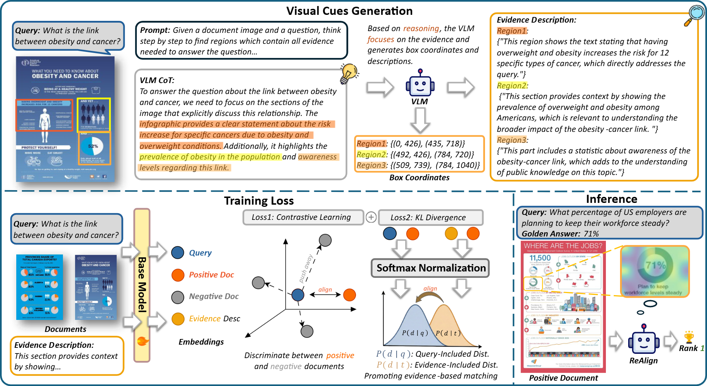

# ReAlign: Optimizing the Visual Document Retriever with Reasoning-Guided Fine-Grained Alignment


<div align="center">
<p align="center" dir="auto">

[](https://github.com/NEUIR/ReAlign)
[]()
[](https://huggingface.co/collections/yanghaoir/realign)

</p>
<p align="center" dir="auto">
<!--
[](https://huggingface.co/yanghaoir/ReAlign-Phi3v)
[](https://huggingface.co/yanghaoir/ReAlign-Qwen)
[](https://huggingface.co/datasets/yanghaoir/ReAlign-Trainset)
-->
Hao Yang<sup>1</sup>,
Yifan Ji<sup>1</sup>,
Zhipeng Xu<sup>1</sup>,
Zhenghao Liu<sup>1</sup>,
Yukun Yan<sup>2</sup>,
Zulong Chen<sup>3</sup>,
Shuo Wang<sup>2</sup>,
Yu Gu<sup>1</sup>,
Ge Yu<sup>1</sup>

<sup>1</sup>Northeastern University, <sup>2</sup>Tsinghua University, <sup>3</sup>Alibaba Group

</p>
</div>

<div align="center">
<p align="center" dir="auto">

• [Overview](#overview) 
• [Collections](#collections) 
• [Setup](#setup) 
• [Training](#training) 
• [Evaluation](#evaluation)
• [Citation](#citation)
• [Contact](#contact)

</p>
</div>

## Overview

We introduce Reasoning-Guided Alignment (ReAlign), a method that enhances visual document retrieval by leveraging the reasoning capability of VLMs to provide fine-grained visual document descriptions as supervision signals for training. The framework supports multiple multimodal backbone models including Phi3 Vision and Qwen2.5 VL.

Our work is accepted by SIGIR 2026 🎉🎉🎉!

If you find this project useful, please give us a star🌟.



## Collections

We have made the following resources available on 🤗[ReAlign collection](https://huggingface.co/collections/yanghaoir/realign).

| Resource              | Description                                              | Link |
|-----------------------|----------------------------------------------------------|------|
| ReAlign-Phi3v    | The visual document retriever based on [Phi-3-vision-128k-instruct](https://huggingface.co/microsoft/Phi-3-vision-128k-instruct)      | 🤗[ReAlign-Phi3v](https://huggingface.co/yanghaoir/ReAlign-Phi3v) |
| ReAlign-Qwen      | The visual document retriever based on [Qwen2.5-VL-7B-Instruct](https://huggingface.co/Qwen/Qwen2.5-VL-7B-Instruct)              | 🤗[ReAlign-Qwen](https://huggingface.co/yanghaoir/ReAlign-Qwen) |
| Training Data         | The data used to train the ReAlign retriever             | 🤗[ReAlign-Trainset](https://huggingface.co/datasets/yanghaoir/ReAlign-Trainset) |

## Setup

(1) Clone this repository:

```bash
git clone git@github.com:NEUIR/ReAlign.git
cd ReAlign
```

(2) Create and activate a Conda environment (Python 3.10):

```bash
conda create -n realign python=3.10 -y
conda activate realign
```

(3) Install dependencies and the editable package:

```bash
pip install -r requirements.txt
pip install -e .
```

## Training

### 1. Prepare Data and Model Paths

All absolute paths for data and model checkpoints are centralized in [`config/dir_config.sh`](config/dir_config.sh). Please download the required assets and set the paths according to the instructions in that file.

```bash
vim config/dir_config.sh
```

### 2. Create Log Directory

```bash
mkdir -p log
```

### 3. Run Training

**Phi3 Vision:**

```bash
bash sh/train_phi3v.sh > log/realign-phi3v.log 2>&1
```

**Qwen2.5 VL:**

```bash
bash sh/train_qwen.sh > log/realign-qwen.log 2>&1
```

## Evaluation

The second argument of each evaluation script is a comma-separated list of GPU IDs. The examples below use four GPUs; adjust to match your hardware (e.g., use `0` for a single GPU).

**Phi3 Vision:**

```bash
bash sh/eval.sh realign-phi3v 0,1,2,3
```

**Qwen2.5 VL:**

```bash
bash sh/eval_qwen.sh realign-qwen 0,1,2,3
```

## Citation


```bibtex
@article{yang2025realign,
      title={ReAlign: Optimizing the Visual Document Retriever with Reasoning-Guided Fine-Grained Alignment},
      author={Yang, Hao and Ji, Yifan and Xu, Zhipeng and Liu, Zhenghao and Yan, Yukun and Chen, Zulong and Wang, Shuo and Gu, Yu and Yu, Ge},
      year={2026}
      url={https://arxiv.org/abs/2604.xxxxx}, 
}
```

## Contact

If you have questions, suggestions, and bug reports, please email: 

```
yanghao123@mails.neu.edu.cn
```
